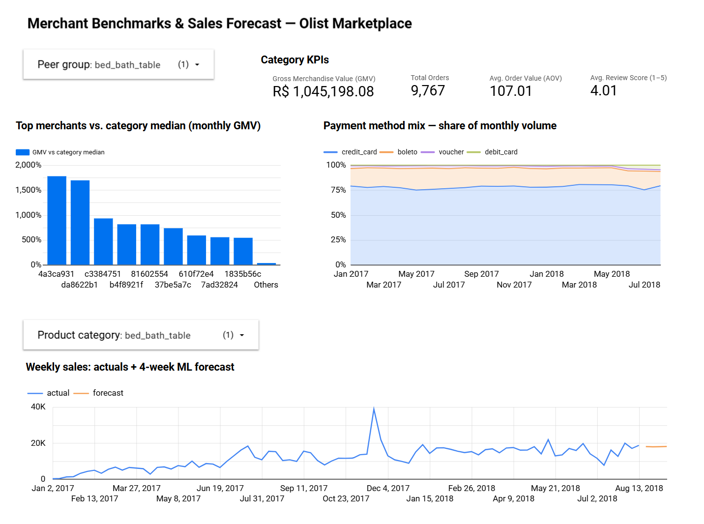
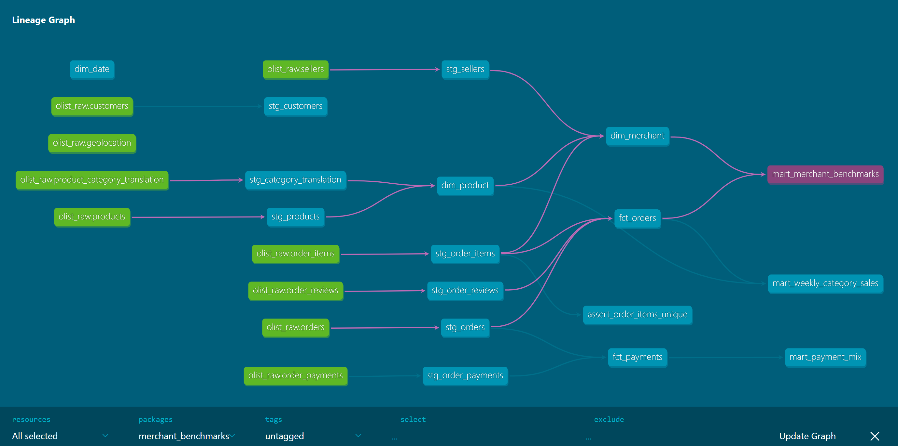

# Merchant Benchmarks Pipeline
**[Live interactive dashboard](https://datastudio.google.com/reporting/eb7209d0-547e-40d1-9554-100ea545d92a)**


*Category KPIs, merchant-vs-peer-median benchmarks, payment mix, and weekly actuals flowing into the 4-week BigQuery ML forecast.*

---
## Project Overview
An end-to-end analytics pipeline on **BigQuery + dbt + BigQuery ML + Looker Studio** that turns raw e-commerce transactions into merchant-facing insights:

> *"How is my store doing compared to businesses like mine and what should I expect to sell next month?"*

This mirrors how a commerce platform turns the transaction data it already collects into products merchants pay for: peer benchmarking, payment analytics, and sales forecasting.


*dbt lineage: raw sources (green) → staging → dims/facts → marts, with the benchmark mart's upstream path highlighted. Regenerate anytime with `dbt docs serve`.*

---
## Architecture

```
Kaggle CSVs (Olist, ~100k orders)
      │  ingest/load_olist.py          (Python → BigQuery load jobs, idempotent)
      ▼
BigQuery  olist_raw.*                  (raw layer: faithful copy of source)
      │  transform/ (dbt)
      ├─ staging   stg_*               (rename, cast, dedupe — views)
      ├─ core      dim_merchant, dim_product, dim_date, fct_orders, fct_payments
      └─ marts     mart_merchant_benchmarks, mart_weekly_category_sales, mart_payment_mix
      │
      ├──► ml/  BigQuery ML ARIMA_PLUS → 4-week sales forecast per category
      └──► Looker Studio dashboard (KPIs, merchant-vs-peers, actuals + forecast)

dags/olist_pipeline_dag.py   Cloud Composer (Airflow) DAG orchestrating the sequence
                             above (example, not deployed)
```

Orchestration: run manually for the demo; [dags/olist_pipeline_dag.py](dags/olist_pipeline_dag.py) shows the production shape on Cloud Composer (Airflow) — see [Design decisions](#design-decisions).

---
## Dataset

[Olist Brazilian E-Commerce](https://www.kaggle.com/datasets/olistbr/brazilian-ecommerce) — ~100k real (anonymized) orders from a marketplace, 2016–2018, across 9 tables: orders, order items, payments, reviews, products, sellers, customers, geolocation, category translations. Sellers play the role of "merchants"; the payments table maps naturally to a payments product.

---
## Setup & run

**Prereqs:** Python 3.9+, [gcloud CLI](https://cloud.google.com/sdk/docs/install), a free [BigQuery Sandbox](https://cloud.google.com/bigquery/docs/sandbox) project.

```bash
# 1. Auth + deps
gcloud auth application-default login
pip install -r requirements.txt

# 2. Data: download from Kaggle (link above), unzip the 9 CSVs into ./data/

# 3. Ingest raw tables into BigQuery
python ingest/load_olist.py --project YOUR_GCP_PROJECT_ID

# 4. Configure dbt: copy transform/profiles.yml.example -> transform/profiles.yml,
#    set your project ID, then:
cd transform
dbt build --profiles-dir .        # runs all models AND all data tests
dbt docs generate --profiles-dir . && dbt docs serve --profiles-dir .   # lineage graph

# 5. Train the forecast + publish views
cd ..
bq query --project_id=YOUR_GCP_PROJECT_ID --use_legacy_sql=false < ml/01_create_forecast_model.sql
bq query --project_id=YOUR_GCP_PROJECT_ID --use_legacy_sql=false < ml/02_forecast_views.sql
```

**Expected results:** 9 raw tables (orders ≈ 99,441 rows); `dbt build` completes with all tests passing; `SELECT * FROM analytics.v_category_sales_forecast` returns 4 forecast weeks × 10 categories.

---
## Dashboard (Looker Studio, free)

To rebuild the dashboard: connect [Looker Studio](https://lookerstudio.google.com) → BigQuery → your project → `analytics`, then build one page:

1. **Scorecards** from `mart_merchant_benchmarks`: total GMV, orders, AOV, avg review score.
2. **Merchant vs. peers** — bar/table from `mart_merchant_benchmarks`: `gmv_vs_median_pct` by merchant, filtered to one category. The "how do I compare to businesses like mine?" view.
3. **Payment mix** — stacked area from `mart_payment_mix`: `share_of_monthly_volume` by `payment_type` over `month_start`.
4. **Actuals + forecast** — time series from `v_sales_actuals_and_forecast`: `sales` over `week_start`, broken down by `series_type`, filtered to one category.

---
## Design decisions

- **Data quality as tests, not hope:** uniqueness, referential integrity, and accepted-value tests run in `dbt build`; a singular test guards the composite item key. `delivered`-only filtering for revenue, review dedup, and edge-week trimming for the time series are documented in the models.
- **Composer not deployed** (~$300+/month for a demo is the wrong trade-off); the DAG file documents the production sequence — ingest → dbt build → model refresh — with retries and scheduling.
- **Forecast limited to top-10 categories:** long-tail categories lack weekly density to model, and it keeps BQML inside the free tier. Pipeline-enables-ML in miniature: the model trains on a tested dbt mart, not on raw data.
- **PII/GDPR:** dataset ships anonymized (hashed IDs, zip prefixes only). In production the raw layer would carry column-level policy tags on PII, datasets split by sensitivity, and access via IAM groups — required under GDPR and SOX change control.
